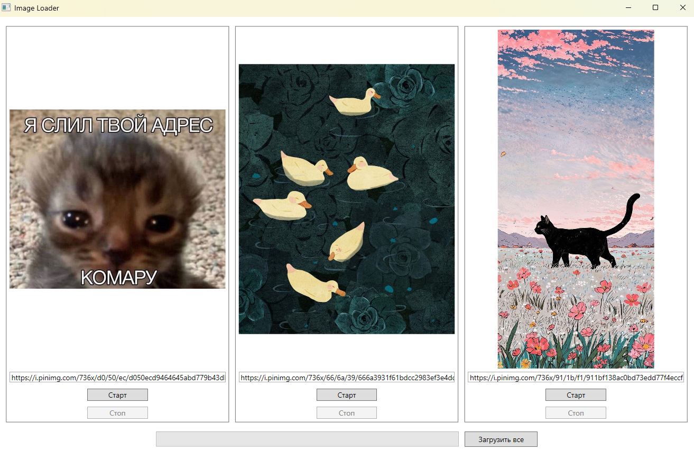

# ImageLoader

Небольшое WPF-приложение, позволяющее параллельно загружать и отображать до трёх изображений из сети.

## Функциональные возможности

* Три независимых слота для загрузки.
    * Поле ввода URL
    * Кнопки **Старт** / **Стоп**
    * Область предпросмотра изображения (автоматически подстраивается под размер ячейки)
* Кнопка **Загрузить все** – запускает загрузку во всех доступных слотах одним нажатием.
* Общий `ProgressBar`, показывающий средний прогресс всех активных загрузок.
* Возможность отмены загрузки любого изображения в любой момент.
* Плавная работа даже при загрузке очень больших файлов (используются потоковые операции и `async/await`).
* Архитектура MVVM без внешних фреймворков.

## Быстрый старт

```bash
git clone https://github.com/danil614/image-loader.git
cd image-loader
dotnet build
dotnet run --project ImageLoader/ImageLoader.csproj
```

## Скриншот

